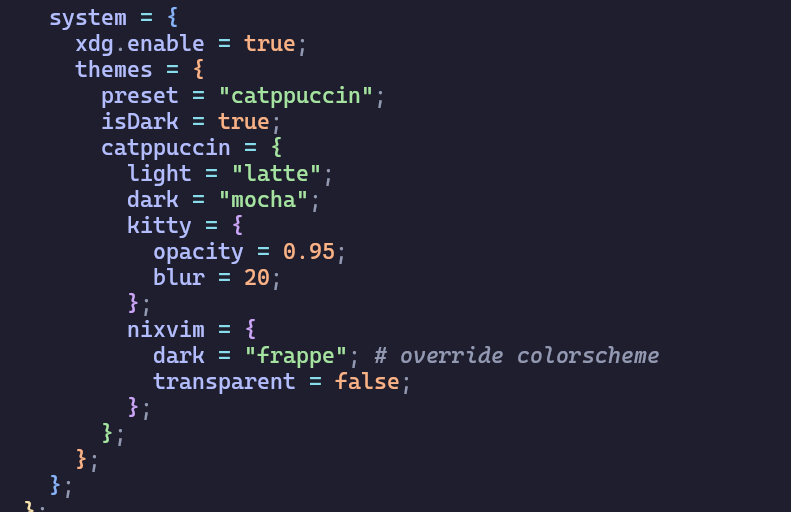
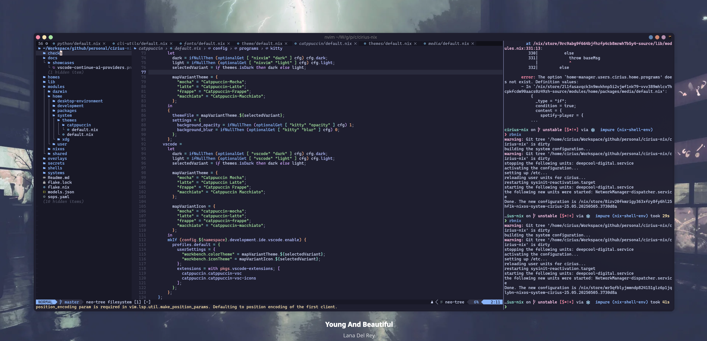
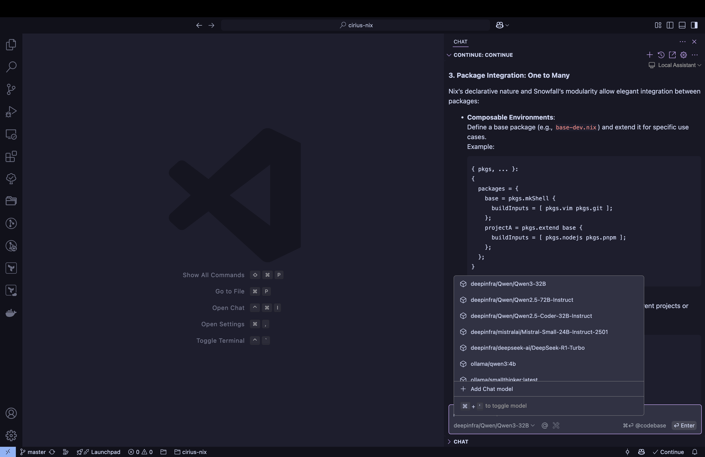

# Cirius Nix (24.11 Beta)

Cirius Nix is my personal dotfiles. Managed by Nix, Snowfall Lib and SOPS to
provide the best user experience ❄️ 

## Why Nix?

Using Nix to manage dotfiles provides several advantages:

- **Declarative Configuration**: Define your environment in code, ensuring
  consistency across machines.
- **Reproducibility**: Achieve identical setups on any machine, anytime.
- **Version Control**: Track configuration changes over time with Git.
- **Isolation**: Per-user configurations without affecting the system.
- **Dependency Management**: Deterministic dependency resolution avoids
  conflicts.
- **Rollbacks**: Easily revert to previous states if something breaks.
- **Cross-Platform Support**: Works on NixOS, Linux, and macOS via Nix-Darwin.

Over three years of using Nix across multiple platforms (NixOS, Linux, and macOS
via Nix-Darwin), I've maintained a crash-free system experience. The dotfiles
configuration enforces strict immutability by default - all configuration files
are managed as symbolic links with restricted permissions (read-only for regular
users). This design prevents accidental modifications while ensuring consistent,
version-controlled configurations across all environments.

### Considerations

While Nix offers powerful features, there are some trade-offs:

- **Learning Curve**: Nix expressions require learning a functional language.
- **Initial Setup Complexity**: Configuration may take time to master.
- **Limited Package Availability**: Some tools may require custom derivations.
- **Performance Overhead**: Nix operations can be slower than traditional tools.
- **Debugging Challenges**: Tracing issues in Nix expressions can be complex.

## Core Components & Features

### Cross-Platform Support

- **NixOS**: Full system configuration
- **Linux**: x86_64/aarch64
- **macOS**: Managed via [Nix-Darwin](https://github.com/LnL7/nix-darwin)
- **Desktop Environments**:
  - KDE Plasma (Wayland) - fully configured
  - Hyprland - in development
- Unique colorscheme across all applications & DE.

### AI Development Stack

- **Providers**:
  - OpenAI, Alibaba, Deepseek, Gemini, Mistral, Groq, Deepinfra, GitHub Copilot
  - Pre-configured models (Qwen3 32B, Deepseek V3, Codestral)
- **Tooling**:
  - VSCode: Continue extensions for AI-assisted development
  - Nixvim: Tabby/Avante plugins (MCP support coming soon)
  - Auto-installs LSP, formatters, and AI integrations
- **Configuration**:
  - Enable via `development.ai.<provider>.enable = true`
  - API keys managed via SOPS in `secrets/${username}/default.yaml`

### Security & Reproducibility

- **Secrets Management**:
  - SOPS encryption (age/GPG) for API keys/tokens
  - Automatic decryption at build time
- **Immutable Configurations**:
  - Read-only dotfiles via symbolic links
  - Version-controlled with Git
  - No plaintext secrets in source control

### Development Environment

- **Language Support**:
  - Golang, TypeScript/JS, Nix, Python, SQL, Java, Terraform, ...
- **Editor Configurations**:
  - **Nixvim**, **VSCode**: LSP, formatter, debugging/testing and AI integration
    plugins
- **Terminal**:
  - Kitty terminal with Fish shell, configured syntax highlighting,
    autosuggestions, powerline-style prompt by **starship**
  - Custom aliases, functions for Nix/AI workflows

### Modular Package Management

- **Design**:
  - System/user-level separation
  - Shared same options between modules (e.g.,
    `development.ai.<provider>.models`)
- **Extensibility**:
  - Add new tools by overriding modules
  - Deterministic dependency resolution
- **Benefits**:
  - Scalable for new projects/users/OSes
  - Collaboration-ready (decrypt secrets and reproduce environments)
  - Auditability via Git history
